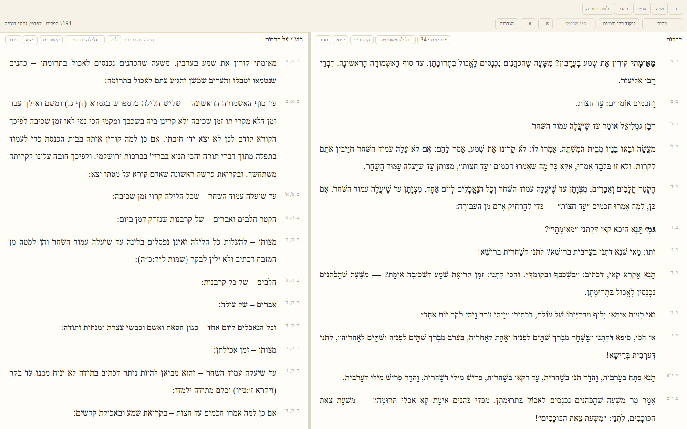
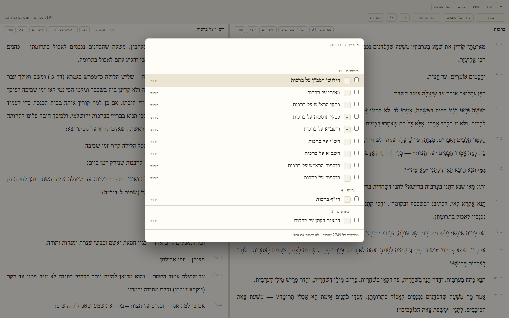

# גִּרְסָא · Girsa

**A Torah library that assumes you are going to write something.**

Girsa (גִּרְסָא, *the text as received*) is the page. **Ksav** (כְּתָב, *writing*)
is the pen. The pairing is the idea, and it is the one thing here that nothing
else does:

> You find a mekor while learning. You send it to what you are writing. The
> citation in the finished PDF opens the page it names — three weeks later, on
> another machine, for whoever you sent the PDF to.

Nothing is retyped, because what gets stored is the **reference**, not a printed
string that looks like one.



<sub>Berakhot 2a with Rashi beside it. The refs in the margin are permanent
segment ids — more in [`docs/images/`](docs/images/), including what these
pictures are and are not evidence for.</sub>

---

## Where to go

| You are here to | Start at |
|---|---|
| **use it** | [`docs/start-here.md`](docs/start-here.md) — five minutes, end to end, and it is the whole idea |
| **install it** | [Getting it](#getting-it), below |
| **contribute** | [`CONTRIBUTING.md`](CONTRIBUTING.md) — setup, the gate, the rules that bind every change |
| **make your first change** | [`docs/your-first-change.md`](docs/your-first-change.md) — one contribution, walked through |
| **understand the design** | [`docs/architecture.md`](docs/architecture.md) — how the pieces fit and why they are split that way |
| **know why something is the way it is** | [`docs/the-record.md`](docs/the-record.md) — every decision beside the defect that caused it |
| **build it from the spec** | [`spec.md`](spec.md), then [`BUILDER.md`](BUILDER.md) |

Full index of every page: [Documentation](#documentation), below.

---

## What it does

**A library.** Sefaria and Otzaria on one shelf, arranged how you arrange it,
offline. Around 5 million segments of text and a graph of 4.2 million links
between them.

**Five ways to search it.** Torat Emet (the default — Hebrew morphology, not
substring matching), literal, phrase, proximity, and regex; plus citation
lookup, gematria, roshei teivot and dilug. Search results show the words you
searched for **highlighted inside the line**, so you can see at a glance which of
eleven hits is the one you meant. And the search panel docks to a column instead
of closing, so when the first result turns out to be the wrong one, the other ten
are still on screen.

**The daf you already know.** Open a mefaresh beside the text and it stays in
step as you scroll. Or tick Rashi, Tosafot and the Rosh, and every line one of
them wrote about gets a **◆** in the margin; click a marked line and their
comments open under that line only.



**The Ksav loop.** Highlight, `Ctrl+Shift+C`, and the words land in your document
with the mareh makom under them, formatted the way you have citations set —
change that setting and every citation you have ever made reformats, because a
reference was stored rather than a string.

**Corrections that are not edits.** A typo you fix is an overlay. The corpus
text is never touched, so the download stays replaceable and your fix survives
re-importing it.

**Links you can argue with.** The graph is Sefaria's and Otzaria's, and it is
wrong in places. You can repair an edge, and your repair is yours and outlives
the next import.

**Scans.** Bring a PDF, tell it which page is which daf once, and it is citable
and searchable like anything else — OCR'd text is badged `OCR` rather than
quietly mixed in.

**Your own layer.** Notes are seforim on your own shelf, joined to the sugya by
the same kind of edge as Rashi — so what you wrote comes back *in the list of
links on that line*, not in a list of its own. Marks, tags, saved queries,
chaburah folders.

**An answer for a program.** The whole library is MCP tools over stdio, with the
same refusals it gives a person.

### What it does not do

Said here rather than discovered later:

- **Nobody has written a real sefer in it.** Three separate audits call that the
  most important line in any of them, and it is still true.
- **No sync, no account.** Your notes and corrections are files on your machine.
  A second machine is a copy, not a login.
- **The corpus is a download, not a repository.** About 11 GB once search is
  built. The installer is 7 MB and carries no seforim.
- **The link graph is incomplete**, visibly: a sefer with no links says *nothing
  links here* when the cache exists and *I have not been told* when it does not.

---

## Getting it

An installer is attached to every `v*` tag on the releases page — the `bundle`
job in [`.github/workflows/ci.yml`](.github/workflows/ci.yml) runs the real
Windows build and uploads the NSIS `.exe` and the MSI.

**The installer carries the application and the tools. It does not carry the
library.** A fresh install is a window with no seforim. Filling it is six steps,
and the first screen says so too:

| | Step | Command | Size |
|---|---|---|---|
| 1 | Fetch Sefaria | `girsa-fetch corpus\sefaria` | ~2.2 GB |
| 2 | Get Otzaria | **you download this yourself** — nothing here fetches it | |
| 3 | Build the shelf | `girsa-import corpus <otzaria>` | |
| 4 | The links between them | `girsa-link-import corpus <otzaria>` | |
| 5 | The caches that read them backwards | `girsa-link-types corpus personal` | |
| 6 | Build search | `girsa-index build index corpus personal` | ~3.6 GB |

**Four of these used to be the whole list, and steps 4 and 5 were the missing
two.** A reader who did the other four had a shelf with no link graph: no
mefarshim on any daf, the מפרשים button reading `לצד` on every sefer, and the
five-minute walkthrough's step 2 — *put Rashi on it* — unreachable. The window
said *I have not been told*, which is the honest sentence for a missing cache
and reads, to somebody nobody told to build one, exactly like a sefer nobody
wrote on.

Those tools are `girsa-tools-windows.zip` on the same release page, a separate
download on purpose: Tauri validates bundled resources when the shell
*compiles*, so naming release binaries there would break `cargo check` for
anybody who had not built them first.

Step 2 is manual, and steps 3 and 4 both refuse without it. Two more are worth
running and nothing refuses without them —
[`docs/tools.md`](docs/tools.md) has them and says what each buys you. If you
already have a corpus, point the window at it — with none it opens on a screen
that says all of the above and offers a folder picker.

Set `GIRSA_CORPUS` and `GIRSA_PERSONAL` to move either root; otherwise the window
looks beside its session file in the app's data directory.

---

## Building from source

### What you need

| | |
|---|---|
| **Rust** | stable, with `clippy` and `rustfmt` |
| **Node** | 22 or later, for the window and for the gate |
| **Linux only** | `libwebkit2gtk-4.1-dev librsvg2-dev patchelf libxdo-dev libssl-dev libgtk-3-dev libayatana-appindicator3-dev` |

Not `libappindicator3-dev` — it conflicts with the ayatana package, apt exits
100, and the job never reaches a compiler.

### Clone and build

```sh
git clone https://github.com/SYKhayyat/girsa
cd girsa
cargo build --all-targets
cargo test
```

**Cloning Girsa alone builds, and no corpus is needed to work on it.** The
shared crates are pinned by git rev in [`Cargo.toml`](Cargo.toml); the test suite
builds its own synthetic shelf through the real importer in about two seconds,
so `cargo test` needs none of the 11 GB. The handful of checks that genuinely
need the download are `#[ignore]`d rather than skipped — on a machine that has
run `girsa-import`:

```sh
cargo test -- --ignored
```

### Run the window

```sh
npm --prefix app install
npm --prefix app run tauri dev
```

### Build the window

```sh
cd app && npx tauri build              # with an installer
cd app && npx tauri build --no-bundle  # just the executable
```

**Not `cargo build --release -p girsa-shell`, and it will now refuse.** That
command embeds no frontend and produces a window that navigates to the Vite dev
server — an executable that looks exactly like the product until you close the
thing it is leaning on. `app/src-tauri/build.rs` panics on it and names the
command that works. Debug builds are untouched, because `cargo check`,
`cargo clippy` and `tauri dev` all want that binary.

### Look at what you changed, without a corpus

The browser build is the cheapest way to see your work. It found four defects in
ten minutes that the whole gate had passed over:

```sh
cargo run -p girsa-app --example dev-fixtures -- corpus app/public/dev
npm --prefix app run dev
```

---

## The gate

One command, and it is the only place the list is written down:

```sh
node tools/verify.mjs               # the gate: nine steps, three directories
node tools/verify.mjs --list        # what they are, without running them
node tools/verify.mjs --from 4      # pick up where a failure stopped it
```

It compiles, tests, lints and formats the workspace; then the Tauri shell, which
`default-members` excludes from the first four because it cannot build before
`app/dist` exists; then the window's types and tests; then `eyes`, the one check
in this repository that has ever seen a pixel.

This used to be a list in prose, in two documents, and what happens to a
nine-command gate written in prose is what happened here: on 13 August the
formatting check — the fourth of the original four, named first in the rule that
listed them — was found failing on eleven files, some of them unformatted for
weeks. Nobody skipped it on purpose. It is the one that never fails when you are
in a hurry, so it is the one that stops being run. A command in a gate that
nobody runs is not in the gate.

Unverified is not done. [`CONTRIBUTING.md`](CONTRIBUTING.md) has the rest of what
a change is expected to carry.

### The repository checks its own documentation

Three habits here are worth knowing before you edit a page:

- **Numbers are marked and re-counted.** A count in this file is followed by an
  invisible marker and re-measured on every push. This file once said *"a window
  and fifty commands"* while there were a hundred, for weeks, and nothing said
  so. `tools/readme-numbers.sh` re-counts them; a test fails if one is stale, and
  a number spelled as a word cannot be marked, by design.
- **Every command a document names exists**, and every command that exists is
  named by a document. The first step of the getting-started page used to tell a
  stranger to run a binary that had never existed in this tree.
- **Every relative link resolves inside this repository.** A `../../Ksav/…` link
  works on the one machine with both checkouts and is broken for everybody
  reading it on GitHub.

---

## How the repository is laid out

```
crates/       the model: corpus, links, search, the reading workspace
app/          the Tauri shell — a window over the crates
  src/          the window: TypeScript, no framework
  src-tauri/    the bridge: commands, and nothing that decides anything
docs/         for a reader, and for a contributor
tools/        the gate, and the generate-and-diff checks
spec.md       what Girsa is
BUILDER.md    what to do on day one, order by order
```

Two roots at run time, and they are not the same kind of thing:

```
corpus/       the download. Rebuildable, replaceable, never yours to edit
personal/     yours: how you arranged the shelf, the seforim you added,
              and everything you wrote — notes, marks, queries, folders
```

`girsa-import` rewrites the whole of `corpus/works/index.jsonl` on every run, so
nothing of yours is ever kept in it.

### The crates

**15**<!--=crates--> crates and **16**<!--=bins--> command-line binaries across
them. Every binary answers `--help`, and [`docs/tools.md`](docs/tools.md) says
what each one is for and the order to run them in.

| Crate | Purpose |
|---|---|
| `girsa-personal` | The one file your own layer is written in: an append-only jsonl log with tombstones, shared by every store under `personal/` |
| `girsa-corpus` | Storage, ingest, schemas, permanent segment IDs |
| `girsa-search` | tantivy indices, the five modes, the ladder, the chips and the facets |
| `girsa-link` | The typed link graph, your repairs to it, later mining |
| `girsa-fix` | Corrections as an overlay, and the ranked OCR queue |
| `girsa-note` | Your own layer: notes as nodes, marks, tags, saved queries, chaburah folders |
| `girsa-scan` | Scans you brought: which page is which daf, and what a page cites as |
| `girsa-lane` | The semantic lane: a side-loaded BERT, the vector store, the resumable job |
| `girsa-app` | The reading workspace: the shelf, tabs and splits, and what keeps two columns together |
| `girsa-desk` | The desk: the buffer you type into, what a highlighted phrase becomes, and which of your documents cite a place |
| `girsa-nearby` | What else is near this, and what an answer could not see |
| `girsa-export` | Handing somebody a sefer with your corrections in it: a clean `.txt` or `.docx` |
| `girsa-mcp` | The library as tools an agent can call, over stdio |
| `girsa-plain` | The two things every binary needs and no corpus explains: how a command line is read, and how *what this answer could not see* is said |
| `girsa-fixture` | A synthetic shelf, built from source-shaped input through the real importer, so a test needs no corpus. Never published; a dev-dependency only |

Plus `girsa-source`, `girsa-ref`, `girsa-hebrew`, `girsa-cite`, `girsa-post` and
`girsa-ksav` from `sefer-crates`, pinned by commit and fetched by cargo.

`girsa-desk`, `girsa-nearby`, `girsa-export` and `girsa-mcp` sit **above**
`girsa-app` rather than beside it, and the reason is the line next to each name.
`girsa-app` is *the shelf, tabs and splits* — and its manifest used to carry a
BERT, three `candle` crates, a document format and `zip`, because three files out
of thirty needed them. So `cargo test -p girsa-app` built a neural network
forward pass in order to retest the taxonomy. Each of those dependencies now
stops at the edge of a crate that is *about* it, the arrow runs one way, and the
reading workspace compiles without any of them — it does not even depend on
`girsa-search`. [`docs/architecture.md`](docs/architecture.md) draws the stack.

### The window

`app/` is the Tauri shell: a window and **118**<!--=commands--> commands, and
**nothing that decides anything**. Where a pane lands, what may sit beside what,
and what the nikud toggle takes off are all answered in `girsa-app`, because
those can be tested and a webview cannot. The window is
**31**<!--=window-modules--> TypeScript modules and one stylesheet of
**3,898**<!--=styles-lines--> lines — no framework, three runtime dependencies.

That is a rule, not a description, and it is enforced. Of the shell's
**4,948**<!--=shell-lines--> lines, about 150 were once genuine pass-through and
the rest decided cache policy, sort orders, truncation lengths, which fonts a
Hebrew reader is offered, and what to do with a chip key it did not recognise.
Each of those now lives in the crate whose subject it is, and two checks fail if
one comes back. [`docs/architecture.md`](docs/architecture.md) has the whole
argument and the table of where each decision went.

### The rules are tests

`crates/girsa-app/tests/the_rules_this_repository_wrote_down.rs` is
**25**<!--=rules--> checks that read this repository's own source and fail when a
rule stated in a doc comment stops being true — a slug worked out twice, a query
prepared twice, a chip family read with a silent fallback, a refusal Rust can
send that the window has no sentence for.

They exist because of the diagnosis this codebase was given: **the design lives
in prose, and prose is not checkable.** The invariants were all written down,
beautifully, next to callers that broke them. Writing it down had been mistaken
for enforcing it.

---

## Status

**Every tier in the spec is built.** The corpus is on the shelf, the graph is on
top of it, there is a window, all five ways of searching it, the Ksav loop in
both directions, corrections as an overlay that never touches the text, a link
graph you can argue with, scans that are citable and readable, what you write as
a sefer on your own shelf joined to the sugya by the same kind of edge as Rashi,
a transmission chain that runs forward from a Gemara to how it became halacha
and back from a ruling to where it came from, an answer to a program over MCP,
and a semantic lane that ships off until you side-load a model.

What each work order was **accepted on** is in [`BUILDER.md`](BUILDER.md) under
*What holds, per work order* — twenty rows of measurements rather than a
checklist of things that felt done.

**Built is not finished, and the distinction is the useful part.** Seven of the
record's twelve pages carry a section saying what the thing just described still
cannot do: the transmission chain is a command and nothing in the window draws
it; a typo you corrected this morning is still findable by the typo and not by
the correction; nobody has dragged a sefer with a mouse; only Windows has ever
been looked at. Those eight lists are collected in
[`docs/not-yet.md`](docs/not-yet.md), and the largest item is on none of them —
**nobody has yet learned a sugya in this.**

The one line worth knowing about the data: each record in the segments file
**carries its own id**, so the file can be sorted, reordered, appended to or
diffed and every anchor still names the same words. A file whose ids were its
line numbers would have quietly reintroduced the defect this whole project
exists to leave behind. [`docs/architecture.md`](docs/architecture.md) explains
why that is the load-bearing decision.

---

## Documentation

**For a reader**

| Page | For |
|---|---|
| [`docs/start-here.md`](docs/start-here.md) | **read this first.** The five minutes that are the whole idea |
| [`docs/from-otzar.md`](docs/from-otzar.md) | you use Otzar HaChochma — what is worse here, and what you can do that you could not |
| [`docs/from-bar-ilan.md`](docs/from-bar-ilan.md) | you use Bar Ilan — including where Girsa is genuinely behind |
| [`docs/not-yet.md`](docs/not-yet.md) | everything this does not do yet, in one place, each with the argument behind it |
| [`docs/shortcuts.md`](docs/shortcuts.md) | every keyboard shortcut, both languages. Generated from the source |
| [`docs/tools.md`](docs/tools.md) | every command this repository can be told to run |
| [`docs/images/`](docs/images/) | screenshots, and what they are and are not evidence for |

**For a contributor**

| Page | For |
|---|---|
| [`CONTRIBUTING.md`](CONTRIBUTING.md) | setup, the gate, the rules, how to send a change |
| [`docs/your-first-change.md`](docs/your-first-change.md) | one contribution end to end, walked through |
| [`docs/architecture.md`](docs/architecture.md) | how the pieces fit, and why the seams are where they are |
| [`spec.md`](spec.md) | what Girsa is. §2, §3 and §16 first |
| [`BUILDER.md`](BUILDER.md) | the work orders, the binding rules, the verified traps in the data |
| [`docs/the-record.md`](docs/the-record.md) | why everything is the way it is — the old README, kept whole, in twelve pages by subject |

**What happened when somebody used it**

Two pages that are not instructions. Somebody who had not built this opened it
and used it, written down without softening.

| Page | What it is |
|---|---|
| [`docs/the-five-minute-report.md`](docs/the-five-minute-report.md) | five minutes, eighteen complaints, and what each fix was |
| [`docs/the-second-sitting.md`](docs/the-second-sitting.md) | an hour with the running window afterwards — and the finding that no build of the application had ever been produced |

Ksav's own pages are in the pen's repository, at `Ksav/docs/`. Not a link,
because a link out of this repository is broken for anybody who cloned only this
one, which is everybody reading it on GitHub.

---

## Licence

MIT or Apache-2.0, at your option — [`COPYRIGHT`](COPYRIGHT).

The corpus is not this repository's to license: Sefaria's texts and Otzaria's
carry their own terms, and [`THIRD-PARTY-NOTICES.md`](THIRD-PARTY-NOTICES.md) is
where every dependency's licence is recorded.
